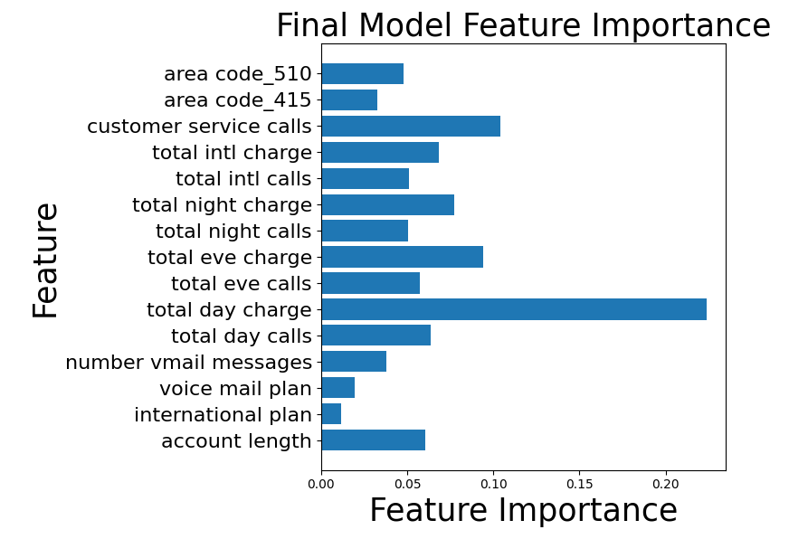
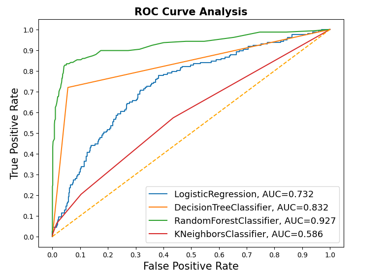

# SyriaTel Communications Churn Analysis

#### Overview

SyriaTel is a mobile network provider in Syria. This project aims to provide insights into the determinant factors of churning as well as predict future cases of churn using different models in order to provide adequate recommendations to the company. This would in turn help to retain customers / product consumers who would otherwise churn.

This would help improve the health of the business while assisting in the forecasting of future revenue for the business. Building a classifier to predict whether a customer will ("soon") stop doing business with SyriaTel, would then provide information on patterns that may exist and shed light on the problem.

#### Business and Data Understanding

The project uses [SyriaTel Customer Churn](https://www.kaggle.com/datasets/becksddf/churn-in-telecoms-dataset) dataset from kaggle. The dataset is going to be used to determine features that are likely very related to the possibility of users to stop or cancel using the services of SyriaTel comunications. In examining these features, it is possible to identify these features and use them to predict future churn possibilities.

The dataset contains 3,333 rows and 21 columns. The columns contain features associated with call information such as number of minutes for calls, time of day the calls were made, the type of call, that is, international of to customer service etcetra. The target feature is the churn in the churn column which shows which consumers stopped using the services as well as which consumers continued using the service. The dataset is also imbalanced as will be seen later and this will need to be addressed as well

>>> * From the above cells we can see that the dataset, there are no null values. This can be seen by the constant count in the description as well as non-null counts in the information about the dataset but this is confirmed in the next section.
>>> * It also identifies 1 boolean column, 8 float and 8 integer columns and finally 4 object type columns. This means that there will be need to convert 5 columns for use including the target feature column.
>>>
>>

##### Problem Statement

SyriaTel Communications needs to reduce the churn rate/ the number of customers dropping from their services in order to have a healthy business. The project aims to advice the company of what features would help them to reduce on this and improve their retention of customers. The data contains details on calls from customers such as the minutes used, the charges as well as the type of calls along with other factors such as area code. This is what will be used in the model.

#### Modeling

The models used for classification include Logistic Regression, Decision Tree Classifier, K-Nearest Neighbors Classifier and Random Forest. There was also a grid search used in the Decision Tree.

For the baseline model, I am going to use logistic regression which will be used as a yardstick measure for the rest of the models. The models that follow are Decision Tree, KNN and Random Forest

The dataset is split into trainning set and testing set and will then be resampled using Synthetic Minority Oversampling Technique to solve for imbalance of the dataset.

The best model in the modeling section is the Decision Tree model done using gridsearch. The recall results are the best for all the models.

#### **Evaluation**

The results would help guide the company to improve customer relations, and enable for the improvement and reduction of churn based on importance of features as shown below.

In this section, I am going to evaluate the results from the models using recall. This is because for a churn problem, the SyriaTel company would benefit more from mitigating False Negatives and increase False Positives. This reduces the chances of labelling a customer who is likely to churn as one who will not churn.

It would be beneficial to label customers who would not churn as likely to churn in order to improve business health. From the dataframe above it is visible that the best model was the Decision Tree GridSearch model as it provided a higher recall result of 78% followed by a GridSearch with 73% and then the baseline Logistic Regression model with 66%.

#### Conclusion

In this section, I am going to evaluate the results from the models using recall. This is because for a churn problem, the SyriaTel company would benefit more from mitigating False Negatives and increase False Positives. This reduces the chances of labelling a customer who is likely to churn as one who will not churn.

It would be beneficial to label customers who would not churn as likely to churn in order to improve business health.

With features such as day time charges and customer service calls, an improvement in such features will aid in the reduction of churn for the company. It would be advisable for the company to concentrate on these features and reduce the probability of churn from their customers.
